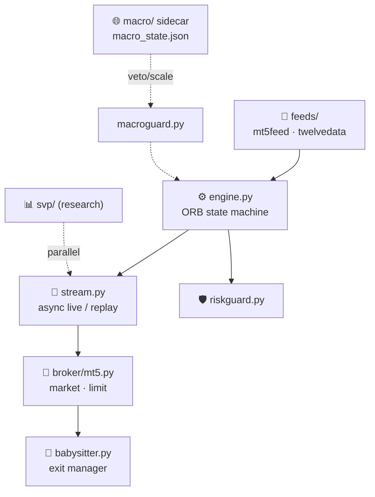

<div align="center">

# 📈 FreqTrading

### `XAU/USD · 1-minute` · `ORB + momentum` · `live MT5 execution`

**Automated gold-scalping bot: opening-range breakout with momentum validation, risk guards, and a live MetaTrader 5 execution layer.**
*בוט סקאלפינג אוטומטי לזהב: פריצת טווח פתיחה עם אימות מומנטום, שומרי סיכון ושכבת הרצה חיה על MetaTrader 5.*

<br/>


<br/>


</div>

---

## 🌍 What is this? · מה זה?

<table>
<tr>
<td width="50%" valign="top">

### 🇬🇧 English

An **automated trading system for XAU/USD on the 1-minute chart**. It trades an
**Opening Range Breakout (ORB)** strategy gated by ROC momentum, with an ATR
ratchet trail and a fixed 20–40 pip stop.

The core engine is a **pure, synchronous state machine** (`IDLE → RANGE_DEFINED →
BREAKOUT → EXIT`) wrapped by an async live layer. Orders route to **MetaTrader 5**
in market or **limit** mode (liquidity-level entry + one addon), guarded **demo-only**
unless `--live` is passed.

A separate **macro sidecar** feeds an optional entry veto / risk-off layer, and a
**standalone SVP** (Session Volume Profile) strategy ships as research — honestly
documented as *net-negative under realistic gold costs*.

</td>
<td width="50%" valign="top">

<div dir="rtl">

### 🇮🇱 עברית

**מערכת מסחר אוטומטית ל-XAU/USD בגרף הדקה.** סוחרת אסטרטגיית **פריצת טווח פתיחה
(ORB)** עם שער מומנטום ROC, טריילינג ATR וסטופ קבוע של 20–40 פיפס.

הליבה היא **מכונת מצבים טהורה וסינכרונית** (`IDLE → RANGE_DEFINED → BREAKOUT →
EXIT`) עטופה בשכבת ריצה אסינכרונית. הפקודות נשלחות ל-**MetaTrader 5** במצב שוק או
**לימיט** (כניסה ברמת נזילות + תוספת אחת), עם הגנת **דמו בלבד** אלא אם מועבר `--live`.

**סיידקאר מאקרו** נפרד מזין שכבת וטו-כניסה / risk-off אופציונלית, ואסטרטגיית **SVP**
עצמאית (פרופיל ווליום) מגיעה כמחקר — מתועדת בכנות כ*שלילית-נטו תחת עלויות זהב ריאליות*.

</div>

</td>
</tr>
</table>

---

## 🧩 Core modules (`orb/`)

| Module | Role |
|--------|------|
| `engine.py` | Pure sync state machine — ROC gate, ATR ratchet, 20–40p stop, partial TP, rearm/rebuild |
| `stream.py` | Async live wrapper · `engine.replay()` for backtests |
| `broker/mt5.py` | MT5 execution — market or limit mode, demo-only guard (`--live` overrides) |
| `babysitter.py` | Per-ticket exit manager — 70% off at +2R, stop chases remainder, tighten-only |
| `riskguard.py` | Daily-loss circuit breaker + momentum-spike limit cancel |
| `macroguard.py` | Pure consumer of `macro_state.json` — entry veto / qty-scale / risk-off (off by default) |
| `trueopen.py` · `quarters.py` | True Open levels (TDO/session/week) · Quarters Theory cycles |
| `feeds/` | `mt5feed.py` (local terminal, preferred live) · `twelvedata.py` (cloud REST + fallback) |
| `svp/` | **Standalone** Session Volume Profile "Edge Rotation" strategy (research, off by default) |

---

## 🧬 Architecture



---

## 🚀 Running

```bash
# Live (full ruleset, demo)
python -m orb live --broker mt5 --qty 0.05 --entry limit \
  --stop-min 2 --stop-max 4 --roc-min 0.15 --spike-cancel 2.5 \
  --max-daily-loss 110 --tp-rrr 2 --session-len 1440 \
  --rearm --rearm-range rebuild --trueopen-filter deadzone

# Backtest a CSV
python -m orb replay <csv>

# Realistic execution sim (limit fills, babysitter, spread+commission)
python scripts/sim_realistic.py data/*.csv

# Fetch data (Twelve Data — TWELVEDATA_API_KEY in .env)
python -m orb fetch

# Tests
pytest      # 226 passing
```

> 🪟 **Windows-only for live orders:** the MT5 terminal must run with **Algo Trading enabled**.
> The core engine + backtests are pure-stdlib and run anywhere.

---

<details>
<summary><b>🌐 Macro layer</b> (M0–M6, sidecar) — click to expand</summary>

<br/>

A separate local process fetches macro/fundamental data (economic calendar, FRED, GDELT,
sentiment, market proxies) and writes a single `macro_state.json`. Each `orb live` reads it
via `orb/macroguard.py` as an entry veto / qty-scale / risk-off layer. **Off by default**
(`--macro-mode off`); fail-safe (macro down ⇒ trade as normal).

- **M1** — ForexFactory calendar + high-impact blackout windows (NFP/CPI/FOMC).
- **M2** — surprise scorer → per-asset bias; `filter` mode vetoes bias-conflicting entries.
- **M3** — GDELT tone + VIX-confirmed `war_spike`; `guard` mode closes positions on hard blackout.
- **M4/M5** — headline sentiment (RSS lexicon) + AI/semis thematic tilt.
- **M6** — backtest gate: PF before/after the macro filter per symbol.

Rollout staged **off → shadow → filter → guard**. See `PLAN_MACRO_LAYER.md`, D-013.

</details>

<details>
<summary><b>📊 SVP research verdict</b> (honest) — click to expand</summary>

<br/>

The standalone **Session Volume Profile** strategy (`--strategy svp`, magic `20260620`) fades
VAH/VAL→POC on balanced days and trades LVN breaks. **It does NOT survive realistic gold costs:**
at a $1.10 spread ($7/lot comm) the edge is net-negative on 1m/5m/15m (break-even spread
≈ $0.55–0.62). Higher timeframe is far safer on drawdown (maxDD 49% on 15m vs 321% before the
risk fix). Top next lever: switch market entries → limit-at-shelf. Research-stage, off by default.
See D-015, D-016.

</details>

<details>
<summary><b>📁 Project lifecycle files</b></summary>

<br/>

Managed under a 5-file lifecycle protocol (`CLAUDE.md`): `README.md` (overview) ·
`STATUS.md` (current state) · `PROGRESS.md` (timeline) · `DECISIONS.md` (decision log) ·
`CLAUDE_MEMORY.md` (AI rules). Strategy spec lives in `STRATEGY.md`; Pine sources in
`AMD_pro_v1.pine`, `Ture_Open_Price.pine`.

</details>

---

<div align="center">

**Built by [@www8351](https://github.com/www8351)**

<sub>Secrets stay out of version control · MT5 demo-guarded · direct, concise, technical.</sub>

</div>
