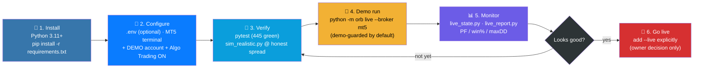
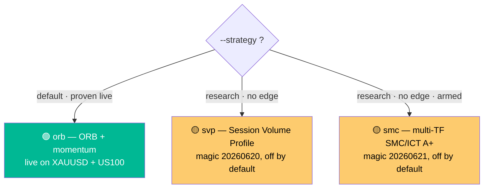
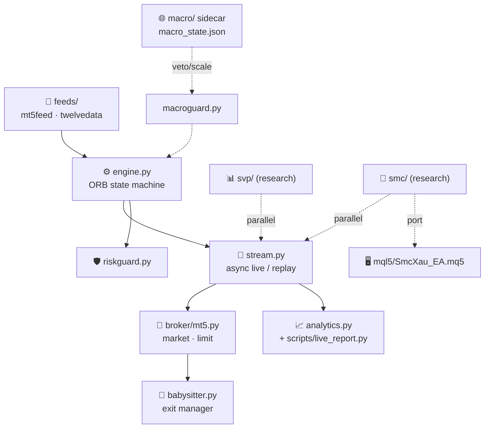

<div align="center">

# 📈 FreqTrading

### `XAU/USD · 1-minute` · `ORB + momentum` · `live MT5 execution`

**Automated gold-scalping bot: opening-range breakout with momentum validation, risk guards, and a live MetaTrader 5 execution layer.**
*בוט סקאלפינג אוטומטי לזהב: פריצת טווח פתיחה עם אימות מומנטום, שומרי סיכון ושכבת הרצה חיה על MetaTrader 5.*

<br/>


<br/>


</div>

---

## 📑 Contents · תוכן עניינים

[What is this?](#-what-is-this--מה-זה) ·
[Roadmap](#️-roadmap--מפת-דרכים) ·
[Operating Guide · מדריך תפעול](#️-operating-guide--מדריך-תפעול) ·
[Core modules](#-core-modules-orb) ·
[Architecture](#-architecture) ·
[Strategy verdicts](#-honest-strategy-verdicts--מסקנות-כנות) ·
[Lifecycle files](#-project-lifecycle-files)

---

## 🌍 What is this? · מה זה?

<table>
<tr>
<td width="50%" valign="top">

### 🇬🇧 English

An **automated trading system for XAU/USD on the 1-minute chart**. It trades an
**Opening Range Breakout (ORB)** strategy gated by ROC momentum, with an ATR
ratchet trail and a fixed 20–40 pip stop.

The core engine is a **pure, synchronous state machine** (`IDLE → RANGE_DEFINED →
BREAKOUT → EXIT`) wrapped by an async live layer. Orders route to **MetaTrader 5**
in market or **limit** mode (liquidity-level entry + one addon), guarded **demo-only**
unless `--live` is passed.

A separate **macro sidecar** feeds an optional entry veto / risk-off layer. Two
**standalone research strategies** ship alongside ORB **SVP** (Session Volume
Profile) and **SMC** (multi-timeframe Smart Money Concepts) both honestly
documented as *net-negative under realistic gold costs* (see verdicts below). A
self-contained **MQL5 EA** ports the SMC engine for MT5 copy-trading.

</td>
<td width="50%" valign="top">

<div dir="rtl">

### 🇮🇱 עברית

**מערכת מסחר אוטומטית ל-XAU/USD בגרף הדקה.** סוחרת אסטרטגיית **פריצת טווח פתיחה
(ORB)** עם שער מומנטום ROC, טריילינג ATR וסטופ קבוע של 20–40 פיפס.

הליבה היא **מכונת מצבים טהורה וסינכרונית** (`IDLE → RANGE_DEFINED → BREAKOUT →
EXIT`) עטופה בשכבת ריצה אסינכרונית. הפקודות נשלחות ל-**MetaTrader 5** במצב שוק או
**לימיט** (כניסה ברמת נזילות + תוספת אחת), עם הגנת **דמו בלבד** אלא אם מועבר `--live`.

**סיידקאר מאקרו** נפרד מזין שכבת וטו-כניסה / risk-off אופציונלית. שתי
**אסטרטגיות מחקר עצמאיות** מגיעות לצד ה-ORB **SVP** (פרופיל ווליום) ו-**SMC**
(Smart Money Concepts רב-טווחי) שתיהן מתועדות בכנות כ*שליליות-נטו תחת עלויות
זהב ריאליות* (ראו מסקנות למטה). **EA ב-MQL5** עצמאי מפעיל את מנוע ה-SMC על MT5
לצורך העתקת מסחר (copy-trading).

</div>

</td>
</tr>
</table>

---

## 🗺️ Roadmap · מפת דרכים

The path from a fresh clone to a live account every arrow is a manual, reviewable
step. Nothing advances to the next box automatically.
*הדרך מ-clone טרי ועד חשבון חי כל חץ הוא שלב ידני שנבדק בעין. שום דבר לא מתקדם
לתיבה הבאה אוטומטית.*



**Choosing a strategy** pick one via `--strategy`; `orb` is the only one proven
live, the other two are documented research (see [verdicts](#-honest-strategy-verdicts--מסקנות-כנות)):



---

## 🕹️ Operating Guide · מדריך תפעול

Every step below is one command. English first, Hebrew (עברית, כתיבה מימין לשמאל)
directly under it the commands themselves are identical in both languages.

<table>
<tr><td width="50%" valign="top">

### 🇬🇧 Step 1 Install

</td><td width="50%" valign="top">

<div dir="rtl">

### 🇮🇱 שלב 1 התקנה

</div>

</td></tr>
<tr><td colspan="2">

Requires **Python 3.11+**. Clone the repo, then:

```bash
pip install -r requirements.txt        # runtime (MetaTrader5 on Windows only)
pip install -r requirements-dev.txt    # dev: pytest, flake8, black (optional)
```

<div dir="rtl">

דורש **Python 3.11 ומעלה**. שכפלו (clone) את המאגר, ואז:
הפקודה למעלה מתקינה את התלויות להרצה (MetaTrader5 בחלונות בלבד) ואת כלי הפיתוח (אופציונלי).

</div>

</td></tr>

<tr><td width="50%" valign="top">

### 🇬🇧 Step 2 Configure

</td><td width="50%" valign="top">

<div dir="rtl">

### 🇮🇱 שלב 2 הגדרה

</div>

</td></tr>
<tr><td colspan="2">

1. Install **MetaTrader 5**, log into a **DEMO account** (JustMarkets or any broker),
   and enable **Algo Trading** (toolbar button must be green).
2. (Optional, for historical data fetch only) create `.env` in the repo root:
   ```env
   TWELVEDATA_API_KEY=your_key_here
   ```
3. **Never commit `.env` or broker credentials.** MT5 login happens inside the
   terminal itself  the bot never touches your password.

<div dir="rtl">

1. התקינו **MetaTrader 5**, התחברו ל-**חשבון דמו** (JustMarkets או כל ברוקר אחר),
   והפעילו **Algo Trading** (כפתור בסרגל הכלים חייב להיות ירוק).
2. (אופציונלי, רק עבור שליפת נתונים היסטוריים) צרו קובץ `.env` בשורש המאגר עם מפתח TwelveData.
3. **לעולם אל תעלו (commit) קובץ `.env` או פרטי גישה לברוקר.** ההתחברות ל-MT5 מתבצעת
   בתוך הטרמינל עצמו הבוט לא נוגע בסיסמה שלכם.

</div>

</td></tr>

<tr><td width="50%" valign="top">

### 🇬🇧 Step 3 Verify (before touching real money)

</td><td width="50%" valign="top">

<div dir="rtl">

### 🇮🇱 שלב 3 אימות (לפני נגיעה בכסף אמיתי)

</div>

</td></tr>
<tr><td colspan="2">

```bash
pytest                                              # 445 tests, must be green
python -m orb replay data/xauusd_1m_*.csv           # signal-only backtest
python scripts/sim_realistic.py data/xauusd_1m_*.csv --spread 0.10 --commission 7
```

Always check backtests **at the honest broker spread**, not an optimistic
assumption every strategy verdict in this repo is graded that way.

<div dir="rtl">

הריצו את הפקודות למעלה: חבילת הבדיקות (445, חייבות להיות ירוקות), בקטסט אותות בלבד,
ואז סימולציית ביצוע ריאליסטית (spread ועמלה אמיתיים). **תמיד** בדקו תוצאות לפי ה-spread
האמיתי של הברוקר, לא לפי הנחה אופטימית כך נבדקת כל אסטרטגיה במאגר הזה.

</div>

</td></tr>

<tr><td width="50%" valign="top">

### 🇬🇧 Step 4 Run on demo (default: `orb`, proven live)

</td><td width="50%" valign="top">

<div dir="rtl">

### 🇮🇱 שלב 4 הרצה על דמו (ברירת מחדל: `orb`, מוכחת בחי)

</div>

</td></tr>
<tr><td colspan="2">

```bash
python -m orb live --broker mt5 --qty 0.05 --entry limit \
  --stop-min 2 --stop-max 4 --roc-min 0.15 --spike-cancel 2.5 \
  --max-daily-loss 110 --tp-rrr 2 --session-len 1440 \
  --rearm --rearm-range rebuild --trueopen-filter deadzone
```

This refuses to run on a **live (non-demo) account** unless you pass `--live`
explicitly the bot cannot accidentally trade real money.

<div dir="rtl">

הפקודה מסרבת לרוץ על **חשבון חי** אלא אם מעבירים `--live` במפורש — הבוט לא יכול
לסחור בכסף אמיתי בטעות.

</div>

</td></tr>

<tr><td width="50%" valign="top">

### 🇬🇧 Step 5 Monitor

</td><td width="50%" valign="top">

<div dir="rtl">

### 🇮🇱 שלב 5 ניטור

</div>

</td></tr>
<tr><td colspan="2">

```bash
python scripts/live_state.py                        # current bots/positions snapshot
python scripts/live_report.py --magic 20260610 --days 30   # XAUUSD ORB PF/win%/maxDD/…
python scripts/live_report.py --known --days 90      # score EVERY known bot at once
```

`live_report.py` prints Profit Factor, win rate, day-win %, avg win/loss, max
drawdown ($ and %), recovery factor, consistency, and time-of-day / duration
breakdowns straight from the MT5 account history, by magic number.

<div dir="rtl">

`live_report.py` מדפיס Profit Factor, אחוז ניצחונות, אחוז ימים מרוויחים, רווח/הפסד
ממוצע, דרדאון מקסימלי (בדולר ובאחוז), פקטור התאוששות, עקביות, ופילוח לפי שעה/משך
עסקה ישירות מהיסטוריית חשבון ה-MT5, לפי מספר magic.

</div>

</td></tr>

<tr><td width="50%" valign="top">

### 🇬🇧 Step 6 Go live (explicit, owner decision only)

</td><td width="50%" valign="top">

<div dir="rtl">

### 🇮🇱 שלב 6 מעבר לחי (החלטה מפורשת של הבעלים בלבד)

</div>

</td></tr>
<tr><td colspan="2">

```bash
python -m orb live --broker mt5 --live --qty 0.05 --entry limit \
  --stop-min 2 --stop-max 4 --roc-min 0.15 --spike-cancel 2.5 \
  --max-daily-loss 110 --tp-rrr 2 --session-len 1440 \
  --rearm --rearm-range rebuild --trueopen-filter deadzone
```

Only add `--live` **after** the demo run shows the numbers you expect in
`live_report.py`. Keep MT5 + Algo Trading running continuously; the daily-loss
breaker (`--max-daily-loss`) is mandatory risk protection, not optional.

<div dir="rtl">

הוסיפו `--live` **רק אחרי** שההרצה על דמו מראה את המספרים שציפיתם להם ב-`live_report.py`.
השאירו את MT5 ו-Algo Trading פועלים ברציפות; שובר ה-daily-loss (`--max-daily-loss`)
הוא הגנת סיכון חובה, לא אופציונלית.

</div>

</td></tr>

<tr><td width="50%" valign="top">

### 🇬🇧 Optional MQL5 EA (SMC engine, copy-trading master)

</td><td width="50%" valign="top">

<div dir="rtl">

### 🇮🇱 אופציונלי EA ב-MQL5 (מנוע SMC, חשבון מאסטר להעתקת מסחר)

</div>

</td></tr>
<tr><td colspan="2">

1. Copy `mql5/SmcXau_EA.mq5` into the terminal's `MQL5/Experts/` folder.
2. Open **MetaEditor**, open the file, press **F7** expect `0 errors, 0 warnings`.
3. Attach it to an **XAUUSD.ecn M15** chart on a **demo** account; confirm Algo
   Trading is enabled.
4. Watch the Experts/Journal tab for bias + confluence log lines on each M15 close.
5. Run a **Strategy Tester** pass (M1, real ticks) before pointing any copy-trade
   master account at it.

<div dir="rtl">

1. העתיקו את `mql5/SmcXau_EA.mq5` לתיקיית `MQL5/Experts/` של הטרמינל.
2. פתחו את **MetaEditor**, פתחו את הקובץ, לחצו **F7** יש לצפות ל-"0 errors, 0 warnings".
3. חברו אותו לגרף **XAUUSD.ecn בטווח M15** בחשבון **דמו**; ודאו ש-Algo Trading פעיל.
4. עקבו אחרי לשונית ה-Journal לשורות לוג של הטיה ומיזוגים (confluence) בכל סגירת M15.
5. הריצו **Strategy Tester** (M1, טיקים אמיתיים) לפני חיבור כל חשבון מאסטר להעתקת מסחר.

</div>

</td></tr>
</table>

---

## 🧩 Core modules (`orb/`)

| Module | Role |
|--------|------|
| `engine.py` | Pure sync state machine ROC gate, ATR ratchet, 20–40p stop, partial TP, rearm/rebuild |
| `stream.py` | Async live wrapper · `engine.replay()` for backtests |
| `broker/mt5.py` | MT5 execution market or limit mode, demo-only guard (`--live` overrides) |
| `babysitter.py` | Per-ticket exit manager 70% off at +2R, stop chases remainder, tighten-only |
| `riskguard.py` | Daily-loss circuit breaker + momentum-spike limit cancel |
| `macroguard.py` | Pure consumer of `macro_state.json` entry veto / qty-scale / risk-off (off by default) |
| `trueopen.py` · `quarters.py` | True Open levels (TDO/session/week) · Quarters Theory cycles |
| `feeds/` | `mt5feed.py` (local terminal, preferred live) · `twelvedata.py` (cloud REST + fallback) |
| `svp/` | **Standalone** Session Volume Profile "Edge Rotation" strategy (research, off by default) |
| `smc/` | **Standalone** multi-timeframe SMC/ICT A+ engine H4/D1 bias (BOS/CHOCH, sweeps, order blocks, POC), M15 confirmation, ≥3 confluences, layered 5R/7R/10R exits + BE/trail (magic 20260621, off by default) |
| `analytics.py` | Pure trade-metrics suite (PF, win rates, maxDD, recovery factor, consistency, by-hour/duration); consumed by backtests + `scripts/live_report.py` |

---

## 🧬 Architecture



---

## 🚀 Running (quick reference)

```bash
# Live (full ORB ruleset, demo)
python -m orb live --broker mt5 --qty 0.05 --entry limit \
  --stop-min 2 --stop-max 4 --roc-min 0.15 --spike-cancel 2.5 \
  --max-daily-loss 110 --tp-rrr 2 --session-len 1440 \
  --rearm --rearm-range rebuild --trueopen-filter deadzone

# Backtest a CSV
python -m orb replay <csv>

# Realistic execution sim (limit fills, babysitter, spread+commission)
python scripts/sim_realistic.py data/*.csv --strategy {orb,svp,smc}

# Score any live bot by magic number
python scripts/live_report.py --known --days 30

# Fetch data (Twelve Data — TWELVEDATA_API_KEY in .env)
python -m orb fetch

# Tests
pytest      # 445 passing
```

> 🪟 **Windows-only for live orders:** the MT5 terminal must run with **Algo Trading enabled**.
> The core engine + backtests are pure-stdlib and run anywhere.
> See the [Operating Guide](#️-operating-guide--מדריך-תפעול) above for the full bilingual walkthrough.

---

## 📊 Honest strategy verdicts · מסקנות כנות

<details>
<summary><b>🌐 Macro layer</b> (M0–M6, sidecar) click to expand</summary>

<br/>

A separate local process fetches macro/fundamental data (economic calendar, FRED, GDELT,
sentiment, market proxies) and writes a single `macro_state.json`. Each `orb live` reads it
via `orb/macroguard.py` as an entry veto / qty-scale / risk-off layer. **Off by default**
(`--macro-mode off`); fail-safe (macro down ⇒ trade as normal).

- **M1**  ForexFactory calendar + high-impact blackout windows (NFP/CPI/FOMC).
- **M2**  surprise scorer → per-asset bias; `filter` mode vetoes bias-conflicting entries.
- **M3**  GDELT tone + VIX-confirmed `war_spike`; `guard` mode closes positions on hard blackout.
- **M4/M5**  headline sentiment (RSS lexicon) + AI/semis thematic tilt.
- **M6**  backtest gate: PF before/after the macro filter per symbol.

Rollout staged **off → shadow → filter → guard**. See `PLAN_MACRO_LAYER.md`, D-013.

</details>

<details>
<summary><b>📊 SVP research verdict</b> (honest) click to expand</summary>

<br/>

The standalone **Session Volume Profile** strategy (`--strategy svp`, magic `20260620`) fades
VAH/VAL→POC on balanced days and trades LVN breaks. **It does NOT survive realistic gold costs:**
at a $1.10 spread ($7/lot comm) the edge is net-negative on 1m/5m/15m (break-even spread
≈ $0.55–0.62). Higher timeframe is far safer on drawdown (maxDD 49% on 15m vs 321% before the
risk fix). Top next lever: switch market entries → limit-at-shelf. Research-stage, off by default.
See D-015, D-016.

</details>

<details>
<summary><b>🎯 SMC research verdict</b> (honest) click to expand</summary>

<br/>

The standalone **multi-timeframe SMC/ICT** engine (`--strategy smc`, magic `20260621`) trades
H4/D1 structural bias (BOS/CHOCH + liquidity sweeps + unmitigated order blocks + POC) confirmed
on M15 with ≥3 confluences, targeting 1:5–1:10 R:R with layered partials and a breakeven/trail
ladder armed at +2R. **The exit ladder works exactly as designed** (asymmetric: winners run ~5R,
losers cap at breakeven/small; multi-day holds fire) but **gold does not survive realistic
costs:** PF **0.46** (73 trades, 2026-03-03→06-12 window) and PF **0.15** (2026-03-21→06-12
window) at real spread. Reconfirms D-016…D-020: no ICT/sweep variant has a replicable gold edge.
**Shipped armed anyway** (owner decision) the negative verdict is recorded, not hidden. Off by
default. See D-027.

</details>

<details>
<summary><b>✅ US100 ORB the one positive-edge result</b> click to expand</summary>

<br/>

The default **ORB** strategy on **US100** is the only strategy in this repo with a confirmed
positive edge at the **real measured spread** (0.6pt, not the conservative 1.0pt assumption):
PF **2.23** on the full backtest window. Not yet robust on every held-out split see D-025.
Live on `US100.ecn`, magic `20260611`.

</details>

<details>
<summary><b>📁 Project lifecycle files</b></summary>

<br/>

Managed under a 5-file lifecycle protocol (`CLAUDE.md`): `README.md` (overview) ·
`STATUS.md` (current state) · `PROGRESS.md` (timeline) · `DECISIONS.md` (decision log) ·
`CLAUDE_MEMORY.md` (AI rules). Strategy spec lives in `STRATEGY.md`; Pine sources in
`AMD_pro_v1.pine`, `Ture_Open_Price.pine`. The MQL5 Expert Advisor port of the SMC engine
(`mql5/SmcXau_EA.mq5`) is self-contained — copy into a terminal's `MQL5/Experts/` and compile.

</details>

---

<div align="center">

**Built by [@www8351](https://github.com/www8351)**

<sub>Secrets stay out of version control · MT5 demo-guarded · direct, concise, technical.</sub>

</div>
